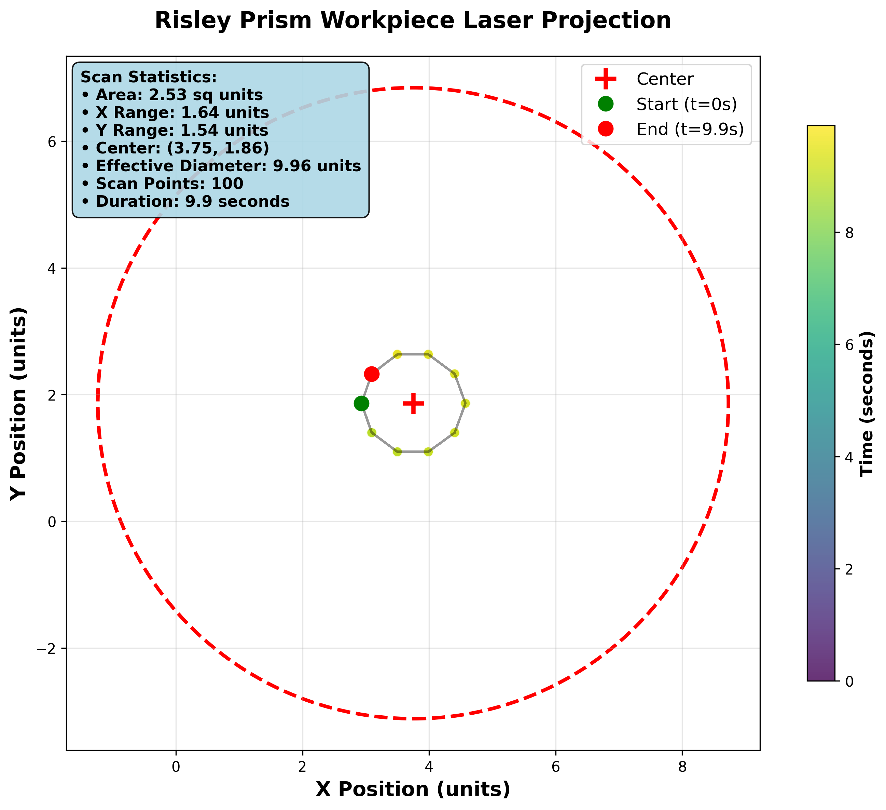
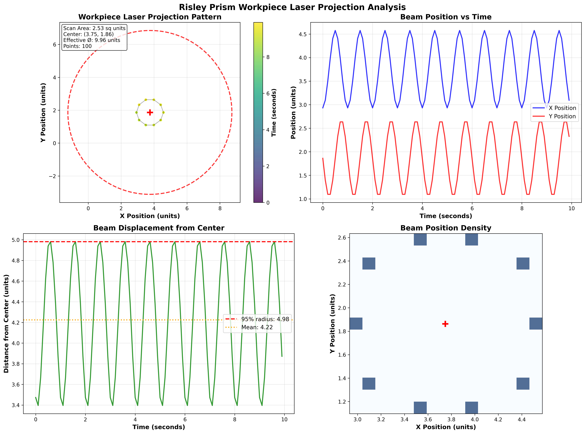

  

# Risley Prism Laser Projection Simulation

  

This Python script simulates the cumulative time-stepped laser projection of a Risley prism system on a workpiece. The Risley prism system consists of multiple rotating prisms (wedges), and the simulation tracks the path of a laser as it passes through each prism and eventually hits a workpiece normal to the Z-axis.

  

## Features

  

-  **Time-Stepped Simulation**: The laser's path is calculated at discrete time intervals, allowing for the observation of the laser's behavior over time as the prisms rotate.

-  **3D Vector Calculations**: The script performs vector calculations to determine the new direction of the laser after passing through each prism based on the rotation of the prisms and the laser's incidence angle.

-  **Dynamic Rotation**: Each prism can be configured to rotate at different speeds, affecting the laser's path differently at each time step.

-  **Refraction Calculations**: The script includes calculations for refraction at each interface of the prisms based on the provided refractive indices.

-  **Cumulative Path Tracking**: All calculated points of the laser's path are tracked and stored for visualization.

  

## Governing Equations

  

The simulation relies on several key physics and geometrical optics equations:

  

1.  **Rotation Calculation**:

$\gamma_{i} = (360  \times N_{i} \times t) \mod  360$

Where $\gamma_{i}$ is the rotation angle for prism $i$, $N_{i}$ is the rotation rate in rotations per second, and $t$ is the current time step in seconds.

2.  **Initial Laser Vector**:

$\mathbf{n1} = [\cos(\text{radians}(\gamma_{i})) \times  \tan(\text{radians}(\phi_{x_i})), \sin(\text{radians}(\gamma_{i})) \times  \tan(\text{radians}(\phi_{x_i})), -1]$

Where $\phi_{x_i}$ is the initial angle of the laser with respect to the x-axis in prism $i$.

3.  **Angle Adjustment**:

$\phi_{x_i} = 90^\circ - \text{degrees}(\arccos(\frac{\mathbf{n1} \cdot  \mathbf{nx}}{|\mathbf{nx}| |\mathbf{n1}|}))$

Similar calculations are performed for the y-component. $\mathbf{nx}$ and $\mathbf{ny}$ are the unit vectors along the x-axis and y-axis, respectively.

4.  **Path Intersection Calculation**:

$P_x = \frac{(x1  \cdot z2 - z1  \cdot x2) \cdot (x3 - x4) - (x1 - x2) \cdot (x3  \cdot z4 - z3  \cdot x4)}{(x1 - x2) \cdot (z3 - z4) - (z1 - z2) \cdot (x3 - x4)}$

$P_z = \frac{(x1  \cdot z2 - z1  \cdot x2) \cdot (z3 - z4) - (z1 - z2) \cdot (x3  \cdot z4 - z3  \cdot x4)}{(x1 - x2) \cdot (z3 - z4) - (z1 - z2) \cdot (x3 - x4)}$

This set of equations is used to calculate the intersection point of the laser with the plane normal to the Z-axis after passing through each prism.

5.  **Application of Refractive Transmission**:

We propose the derived generalized equation of Snell's Law's for vectors. The LASER data is fed through into a prism's tangent plane and the transmission is calculated. This is ultimately iterated throughout the Risley Prism

**Normalize the vectors N and Si​**:

Normal of Tangent Plane:

$$N = \frac{1}{\sqrt{\tan(\phi_x)^2 + 1}} \begin{bmatrix} \tan(\phi_x) \\ 0 \\ -1 \end{bmatrix}$$

Input Vector:

$$s_i = \frac{1}{\sqrt{\tan(\theta_x)^2 + 1}} \begin{bmatrix} \tan(\theta_x) \\ 0 \\ 1 \end{bmatrix}$$

Governing equation:

$$s_f = \left(\frac{n_i}{n_{i+1}}\right) \left(N \times \left(-N \times s_i\right)\right) - N \left(\sqrt{1 - \left(\frac{n_i}{n_{i+1}}\right)^2 \left((N \times s_i) \cdot (N \times s_i)\right)}\right)$$

Output angle equation:

$$\theta_{x_{i+1}} = \left(\frac{\left|s_f\right|}{s_f}\right) \cdot \cos^{-1}\left(\frac{\hat{z} \cdot s_f}{\|s_f\| \cdot \|\hat{\bold{z}}\|}\right)$$

## Simulation Results

The simulation generates comprehensive workpiece projection analysis with professional visualization:

### Workpiece Laser Projection


The simulation shows the laser scan pattern on the workpiece with detailed statistics including scan area (2.53 sq units), effective diameter (9.96 units), and temporal progression over 9.9 seconds with 100 scan positions.

### Advanced Analysis Dashboard


Comprehensive analysis includes:
- **Scan Pattern Visualization**: Color-coded temporal progression showing beam trajectory
- **Position vs Time**: X and Y coordinate evolution showing sinusoidal rotation patterns  
- **Displacement Analysis**: Distance from center with 95% radius calculations
- **Density Mapping**: 2D histogram showing beam position distribution

## Visualization

The simulation outputs multiple visualization formats:
- **3D scatter plots** of laser positions with temporal color coding
- **Workpiece projection analysis** with statistical overlays  
- **Time-series analysis** of beam displacement and rotation
- **Professional styling** with dark themes and enhanced wedge rendering

## Installation & Usage

### Requirements
- Python 3.8+
- NumPy
- Matplotlib
- SciPy

### Running the Simulation
```bash
python model.py
```

### Configuration
Edit `inputs.py` to modify simulation parameters:
- Wedge angles and refractive indices
- Rotation speeds and directions
- Time step resolution
- Visualization options

### Output Files
The simulation generates comprehensive output in the `output/` directory:
- `workpiece_projection.png` - Main scan pattern visualization
- `workpiece_projection_analysis.png` - Multi-panel analysis dashboard
- `workpiece_projections.csv` - Raw coordinate data with timestamps
- `workpiece_analysis.txt` - Statistical summary of scan metrics
- `simulation_data.pkl` - Complete simulation state for analysis

## Technical Features

- **High-Performance Ray Tracing**: Optimized vector calculations with trigonometric caching
- **Robust Input Validation**: Comprehensive parameter checking and error handling
- **Advanced Analytics**: Statistical analysis of scan patterns and beam coverage
- **Professional Visualization**: Publication-quality plots with temporal color coding
- **Flexible Configuration**: Easy parameter adjustment for different optical setups