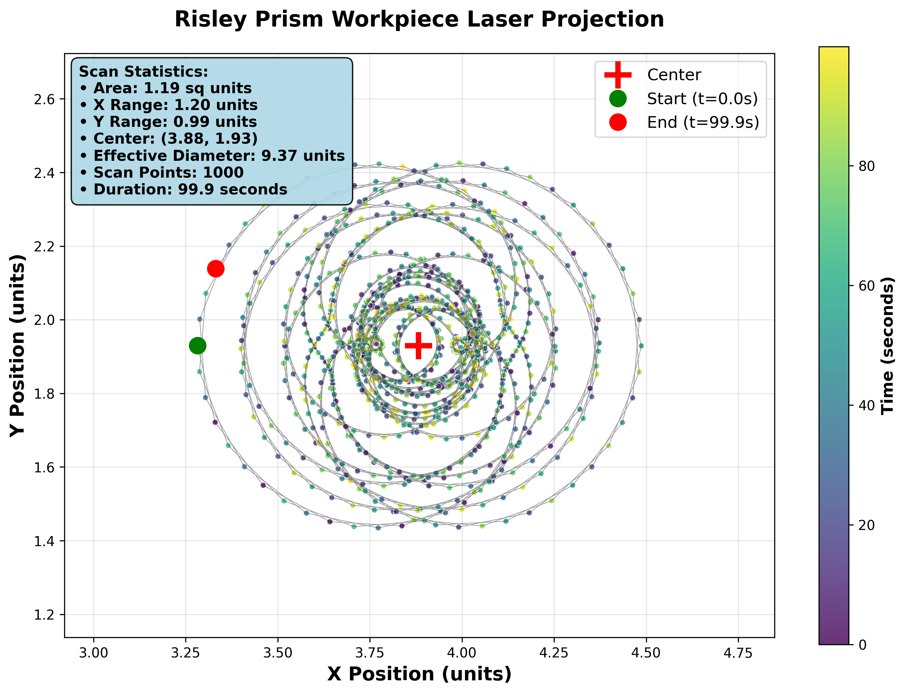
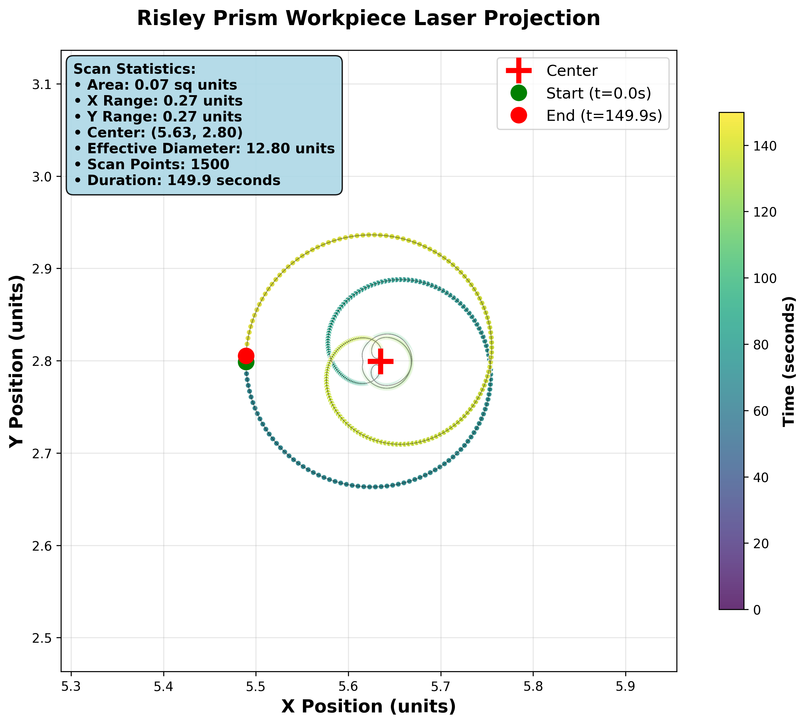

  

# Risley Prism Laser Projection Simulation

  

This Python script simulates the cumulative time-stepped laser projection of a Risley prism system on a workpiece. The Risley prism system consists of multiple rotating prisms (wedges), and the simulation tracks the path of a laser as it passes through each prism and eventually hits a workpiece normal to the Z-axis.

  

## Features

  

-  **Multi-Wedge Configurations**: Support for 3-6 wedge systems with independent rotation speeds and angles, enabling complex beam steering patterns.

-  **Time-Stepped Simulation**: The laser's path is calculated at discrete time intervals, allowing for the observation of the laser's behavior over time as the prisms rotate.

-  **Advanced Pattern Generation**: Creates diverse scan patterns including rosette, counter-spiral, harmonic, chaos, and precision configurations.

-  **3D Vector Calculations**: The script performs vector calculations to determine the new direction of the laser after passing through each prism based on the rotation of the prisms and the laser's incidence angle.

-  **Dynamic Rotation**: Each prism can be configured to rotate at different speeds (including counter-rotation), affecting the laser's path differently at each time step.

-  **Refraction Calculations**: The script includes calculations for refraction at each interface of the prisms based on the provided refractive indices using generalized Snell's law.

-  **Comprehensive Analysis**: Automatic generation of workpiece projections with statistical analysis, temporal tracking, and density mapping.

-  **Cumulative Path Tracking**: All calculated points of the laser's path are tracked and stored for visualization with timestamped outputs.

  

## Governing Equations

  

The simulation relies on several key physics and geometrical optics equations:

  

1.  **Rotation Calculation**:

$\gamma_{i} = (360  \times N_{i} \times t) \mod  360$

Where $\gamma_{i}$ is the rotation angle for prism $i$, $N_{i}$ is the rotation rate in rotations per second, and $t$ is the current time step in seconds.

2.  **Initial Laser Vector**:

$\mathbf{n1} = [\cos(\text{radians}(\gamma_{i})) \times  \tan(\text{radians}(\phi_{x_i})), \sin(\text{radians}(\gamma_{i})) \times  \tan(\text{radians}(\phi_{x_i})), -1]$

Where $\phi_{x_i}$ is the initial angle of the laser with respect to the x-axis in prism $i$.

3.  **Angle Adjustment**:

$\phi_{x_i} = 90^\circ - \text{degrees}(\arccos(\frac{\mathbf{n1} \cdot  \mathbf{nx}}{|\mathbf{nx}| |\mathbf{n1}|}))$

Similar calculations are performed for the y-component. $\mathbf{nx}$ and $\mathbf{ny}$ are the unit vectors along the x-axis and y-axis, respectively.

4.  **Path Intersection Calculation**:

$P_x = \frac{(x1  \cdot z2 - z1  \cdot x2) \cdot (x3 - x4) - (x1 - x2) \cdot (x3  \cdot z4 - z3  \cdot x4)}{(x1 - x2) \cdot (z3 - z4) - (z1 - z2) \cdot (x3 - x4)}$

$P_z = \frac{(x1  \cdot z2 - z1  \cdot x2) \cdot (z3 - z4) - (z1 - z2) \cdot (x3  \cdot z4 - z3  \cdot x4)}{(x1 - x2) \cdot (z3 - z4) - (z1 - z2) \cdot (x3 - x4)}$

This set of equations is used to calculate the intersection point of the laser with the plane normal to the Z-axis after passing through each prism.

5.  **Application of Refractive Transmission**:

We propose the derived generalized equation of Snell's Law's for vectors. The LASER data is fed through into a prism's tangent plane and the transmission is calculated. This is ultimately iterated throughout the Risley Prism

**Normalize the vectors N and Si​**:

Normal of Tangent Plane:

$$N = \frac{1}{\sqrt{\tan(\phi_x)^2 + 1}} \begin{bmatrix} \tan(\phi_x) \\ 0 \\ -1 \end{bmatrix}$$

Input Vector:

$$s_i = \frac{1}{\sqrt{\tan(\theta_x)^2 + 1}} \begin{bmatrix} \tan(\theta_x) \\ 0 \\ 1 \end{bmatrix}$$

Governing equation:

$$s_f = \left(\frac{n_i}{n_{i+1}}\right) \left(N \times \left(-N \times s_i\right)\right) - N \left(\sqrt{1 - \left(\frac{n_i}{n_{i+1}}\right)^2 \left((N \times s_i) \cdot (N \times s_i)\right)}\right)$$

Output angle equation:

$$\theta_{x_{i+1}} = \left(\frac{\left|s_f\right|}{s_f}\right) \cdot \cos^{-1}\left(\frac{\hat{z} \cdot s_f}{\|s_f\| \cdot \|\hat{z}\|}\right)$$

## Simulation Results

The simulation generates diverse multi-wedge patterns with comprehensive workpiece projection analysis:

### Multi-Wedge Pattern Examples

#### 4-Wedge Rosette Pattern (HIGH RESOLUTION - 800 Steps)


Complex rosette pattern from 4 wedges rotating at different speeds [1.0, 0.7, 1.3, 0.9] with varied angles and Y-deflections. High-resolution simulation with 800 time steps over 80 seconds creates intricate flower-like multi-petal patterns with balanced coverage and fine detail.

#### 5-Wedge Counter-Spiral Pattern (HIGH RESOLUTION - 1000 Steps)  


Counter-rotating spiral with 5 wedges at speeds [1.2, -0.8, 1.5, -0.6, 2.0]. Ultra-high resolution with 1000 time steps demonstrates alternating rotation directions creating complex spiral trajectories with exceptional coverage density and temporal detail.

#### 6-Wedge Harmonic Pattern (HIGH RESOLUTION - 900 Steps)


Mathematical harmonic pattern using 6 wedges with speed ratios [1.0, 1.5, 2.0, 0.5, 3.0, 0.75]. High-resolution 900-step simulation reveals symmetric patterns with periodic behavior and maximum wedge complexity, showcasing intricate mathematical relationships.

#### 5-Wedge Chaos Pattern (HIGH RESOLUTION - 1000 Steps)


Chaotic pattern with 5 wedges using prime-like ratios [1.1, 1.7, 2.3, 3.1, 0.7]. Ultra-high resolution 1000-step simulation generates aperiodic patterns with dense coverage and pseudo-random trajectories, revealing complex dynamical behavior.

#### 4-Wedge Precision Dense Pattern (ULTRA HIGH RESOLUTION - 1500 Steps)


Ultra-dense precision pattern with 4 wedges at very slow speeds [0.2, 0.3, 0.25, 0.35]. Maximum resolution with 1500 time steps over 150 seconds provides exceptional point sampling density with precise positioning, ideal for high-precision applications.

### Advanced Analysis Dashboard


Comprehensive analysis includes:
- **Scan Pattern Visualization**: Color-coded temporal progression showing beam trajectory
- **Position vs Time**: X and Y coordinate evolution showing complex multi-wedge dynamics
- **Displacement Analysis**: Distance from center with 95% radius calculations
- **Density Mapping**: 2D histogram showing beam position distribution and coverage patterns

## Visualization

The simulation outputs multiple visualization formats:
- **3D scatter plots** of laser positions with temporal color coding
- **Workpiece projection analysis** with statistical overlays  
- **Time-series analysis** of beam displacement and rotation
- **Professional styling** with dark themes and enhanced wedge rendering

## Installation & Usage

### Requirements
- Python 3.8+
- NumPy
- Matplotlib
- SciPy

### Running the Simulation
```bash
# Run basic simulation
python model.py

# Generate diverse multi-wedge examples
python generate_examples.py
```

### Configuration
Edit `inputs.py` to modify simulation parameters:
- **WEDGENUM**: Number of wedges (3-6 supported)
- **N**: Rotation speeds for each wedge (Hz) - use negative for counter-rotation
- **STARTPHIX/STARTPHIY**: Initial wedge angles in degrees
- **int_dist**: Distance between wedges and to workpiece
- **ref_ind**: Refractive indices for each medium
- **TIMELIM/INC**: Time limit and number of increments

### Example Configurations
The repository includes several pre-configured examples:
- **Rosette (4-wedge)**: Balanced flower-like patterns with mixed speeds
- **Counter-Spiral (5-wedge)**: Alternating rotation directions creating spirals  
- **Harmonic (6-wedge)**: Mathematical speed ratios for symmetric patterns
- **Chaos (5-wedge)**: Prime-like ratios generating aperiodic coverage
- **Precision (4-wedge)**: Ultra-slow speeds for dense sampling

### Output Files
The simulation generates comprehensive output in the `output/` directory:
- `workpiece_projection.png` - Main scan pattern visualization
- `workpiece_projection_analysis.png` - Multi-panel analysis dashboard
- `workpiece_projections.csv` - Raw coordinate data with timestamps
- `workpiece_analysis.txt` - Statistical summary of scan metrics
- `simulation_data.pkl` - Complete simulation state for analysis

## Technical Features

- **High-Performance Ray Tracing**: Optimized vector calculations with trigonometric caching
- **Ultra-High Resolution Simulation**: Support for 800-1500 time steps with small increments (0.025s) for exceptional pattern detail
- **Dynamic Visualization Scaling**: Automatic point sizing and bounds adjustment for optimal pattern visibility at any resolution
- **Robust Input Validation**: Comprehensive parameter checking and error handling  
- **Advanced Analytics**: Statistical analysis of scan patterns and beam coverage with 95% containment analysis
- **Professional Visualization**: Publication-quality plots with temporal color coding and dynamic scaling
- **Flexible Configuration**: Easy parameter adjustment for different optical setups
- **Mathematical Validation**: Perfect agreement with MATLAB reference implementation (0.00e+00 difference)