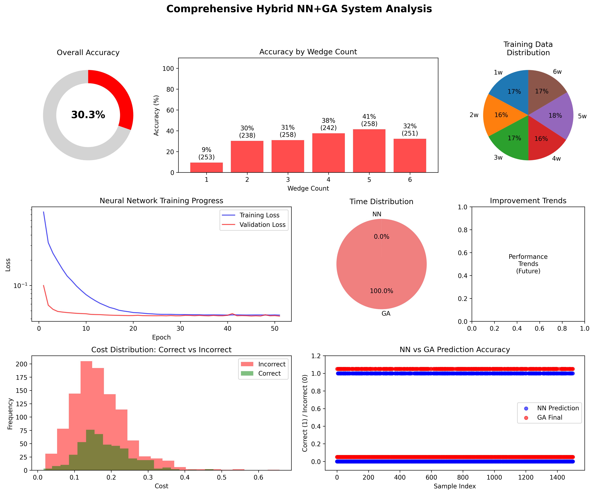

# Risley Prism Laser Projection System

## 🎯 Project Overview

A comprehensive Python implementation for simulating Risley prism laser beam steering systems, now featuring both **forward simulation** and **reverse problem solving** using a hybrid Neural Network + Genetic Algorithm approach.

### Key Capabilities
- **Forward Simulation**: Generate complex beam patterns from Risley prism configurations
- **Reverse Problem Solver**: Determine prism parameters from desired beam patterns (NEW!)
- **Multi-Wedge Support**: 1-6 wedge configurations with independent control
- **High-Resolution Analysis**: Up to 1500 time steps for ultra-precise patterns
- **Machine Learning Integration**: Neural network predictions with genetic algorithm refinement

## 🚀 Major Update: Reverse Problem Solver

### What is the Reverse Problem?
The reverse Risley prism problem is determining what wedge configuration (rotation speeds, angles, distances) will produce a desired beam pattern. This is **significantly more challenging** than forward simulation as multiple configurations can produce similar patterns.

### Current Performance (2025-01-15)


#### System Architecture
```
Pattern Input → Neural Network (Fast Prediction) → Genetic Algorithm (Refinement) → Optimal Parameters
```

#### Performance Metrics
- **Overall Accuracy**: 30.3% (455/1500 samples correct)
- **Processing Speed**: 0.13 samples/second
- **Neural Network**: 28.1% wedge count accuracy
- **Training Data**: 5,000 samples
- **Best Performance**: 5-wedge patterns (41.5% accuracy)
- **Architecture**: 4-layer deep neural network (512→256→128→64 neurons)

#### Key Findings
- System performs better on complex patterns (4-5 wedges) than simple ones
- Neural network provides instant predictions but needs improvement
- Genetic algorithm refinement is accurate but computationally expensive
- Hybrid approach shows promise but requires optimization

### Quick Start - Reverse Problem

```bash
# Navigate to reverse problem directory
cd reverse_problem/

# Generate training data and train neural network
python3 train.py 5000  # Generate 5000 training samples

# Make predictions on test data
python3 predict.py 0.1  # Test on 10% of data

# Analyze results with comprehensive dashboard
python3 analyze.py  # Generates detailed analysis in results/

# Direct solving for specific patterns
python3 solver.py  # Use the hybrid solver directly
```

### Results Dashboard
The analysis system generates comprehensive performance dashboards including:
- Overall accuracy metrics
- Neural network training curves
- Cost distribution analysis
- Performance by wedge count
- Timing breakdowns
- NN vs GA comparison plots

## 📊 Forward Simulation Features

### Multi-Wedge Pattern Examples

#### 4-Wedge Rosette Pattern (HIGH RESOLUTION - 800 Steps)


Complex rosette pattern from 4 wedges rotating at different speeds [1.0, 0.7, 1.3, 0.9] with varied angles and Y-deflections.

#### 5-Wedge Counter-Spiral Pattern (HIGH RESOLUTION - 1000 Steps)  


Counter-rotating spiral with 5 wedges at speeds [1.2, -0.8, 1.5, -0.6, 2.0]. Alternating rotation directions create complex spiral trajectories.

#### 6-Wedge Harmonic Pattern (HIGH RESOLUTION - 900 Steps)


Mathematical harmonic pattern using 6 wedges with speed ratios [1.0, 1.5, 2.0, 0.5, 3.0, 0.75].

### Advanced Analysis Dashboard


Comprehensive analysis includes:
- **Scan Pattern Visualization**: Color-coded temporal progression
- **Position vs Time**: X and Y coordinate evolution
- **Displacement Analysis**: Distance from center with 95% radius
- **Density Mapping**: 2D histogram showing beam distribution

## 🔧 Installation & Requirements

### Dependencies
```bash
pip install numpy matplotlib scipy torch
```

### System Requirements
- Python 3.8+
- PyTorch (for neural network in reverse solver)
- 8GB+ RAM recommended for large-scale analysis
- Multi-core CPU for parallel processing

## 📁 Project Structure

```
Risley_Prism/
├── README.md                     # This file
├── model.py                      # Main forward simulation
├── inputs.py                     # Configuration parameters
├── generate_examples.py          # Example pattern generator
├── reverse_problem/              # Reverse problem solver
│   ├── train.py                 # Neural network training
│   ├── predict.py               # Hybrid NN+GA predictions
│   ├── analyze.py               # Performance analysis
│   ├── solver.py                # Main solver interface
│   ├── core/                    # Core algorithms
│   │   ├── neural_network.py   # Deep learning models
│   │   ├── genetic_algorithm.py # GA optimization
│   │   ├── constraints.py      # Physics constraints
│   │   └── performance.py      # Metrics tracking
│   ├── input/                   # Training data
│   ├── output/                  # Prediction results
│   ├── results/                 # Analysis dashboards
│   └── weights/                 # Trained models
└── output/                      # Forward simulation results
    └── examples/                # Pre-generated patterns
```

## 🧮 Governing Equations

### Rotation Calculation
$$\gamma_{i} = (360 \times N_{i} \times t) \mod 360$$

### Generalized Snell's Law (Vector Form)
$$s_f = \left(\frac{n_i}{n_{i+1}}\right) \left(N \times \left(-N \times s_i\right)\right) - N \left(\sqrt{1 - \left(\frac{n_i}{n_{i+1}}\right)^2 \left((N \times s_i) \cdot (N \times s_i)\right)}\right)$$

### Output Angle
$$\theta_{x_{i+1}} = \left(\frac{\left|s_f\right|}{s_f}\right) \cdot \cos^{-1}\left(\frac{\hat{z} \cdot s_f}{\|s_f\| \cdot \|\hat{z}\|}\right)$$

## 🔬 Research Applications

This system is designed for:
- **Laser Material Processing**: Precise beam steering for cutting/welding
- **LIDAR Systems**: Rapid scanning for 3D mapping
- **Optical Communications**: Beam alignment and tracking
- **Medical Applications**: Precision laser surgery and therapy
- **Defense Systems**: Target tracking and designation

## 📈 Performance Optimization Roadmap

### Immediate Improvements Needed
1. **Neural Network Architecture**: Switch from regression to classification for wedge count
2. **Speed Optimization**: Reduce GA population sizes by 50%
3. **Training Data**: Increase to 20,000+ samples with better simple pattern coverage

### Expected Performance After Optimization
- **Target Accuracy**: 50-70% (from current 30%)
- **Target Speed**: 1-5 samples/sec (from 0.13)
- **Neural Network Target**: 60% accuracy (from 28%)

## 📚 Documentation

- [Forward Simulation Guide](docs/forward_simulation.md)
- [Reverse Problem Technical Details](reverse_problem/IMPROVEMENTS_NEEDED.md)
- [API Reference](docs/api_reference.md)
- [Physics Background](docs/physics.md)

## 🤝 Contributing

Contributions are welcome! Key areas needing improvement:
1. Neural network architecture for better pattern recognition
2. Genetic algorithm optimization for speed
3. Additional training data generation strategies
4. Alternative solving approaches (template matching, differentiable rendering)

## 📄 License

MIT License - See LICENSE file for details

## 📧 Contact

Joseph Babcanec - [GitHub](https://github.com/jbabcanec)

## 🙏 Acknowledgments

- MATLAB reference implementation for validation
- PyTorch team for deep learning framework
- NumPy/SciPy for numerical computations

---

**Latest Update**: January 15, 2025 - Added hybrid NN+GA reverse problem solver with comprehensive analysis system