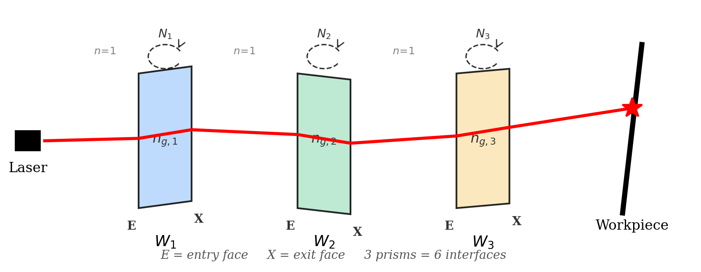
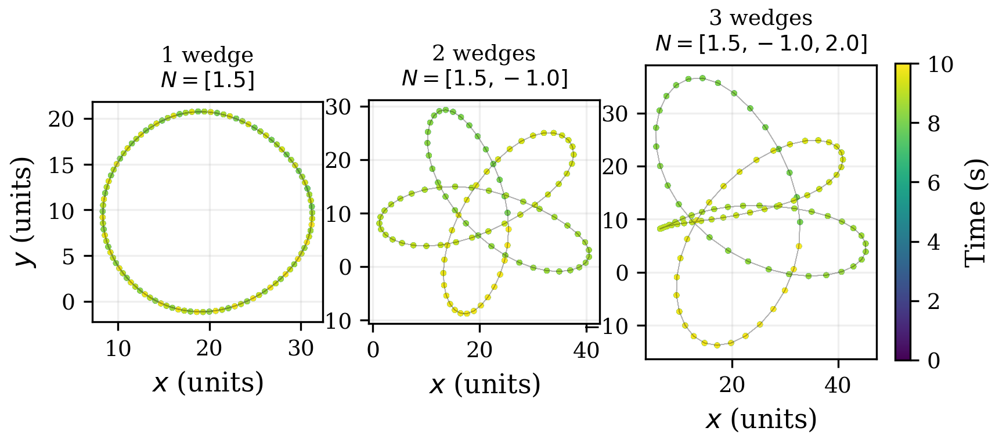
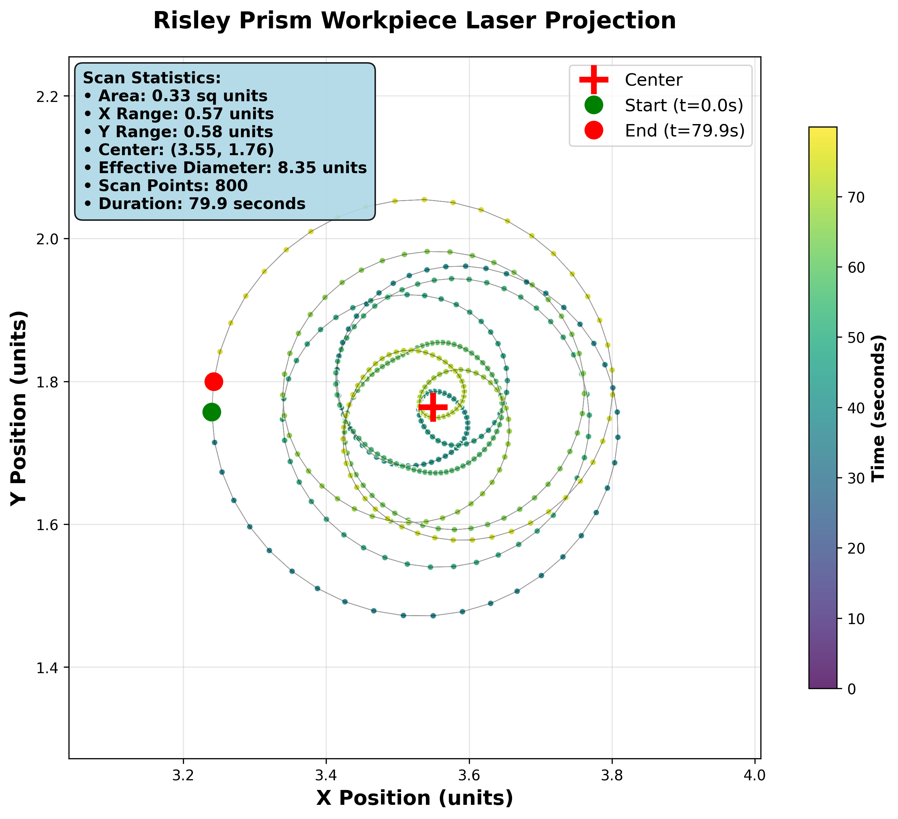
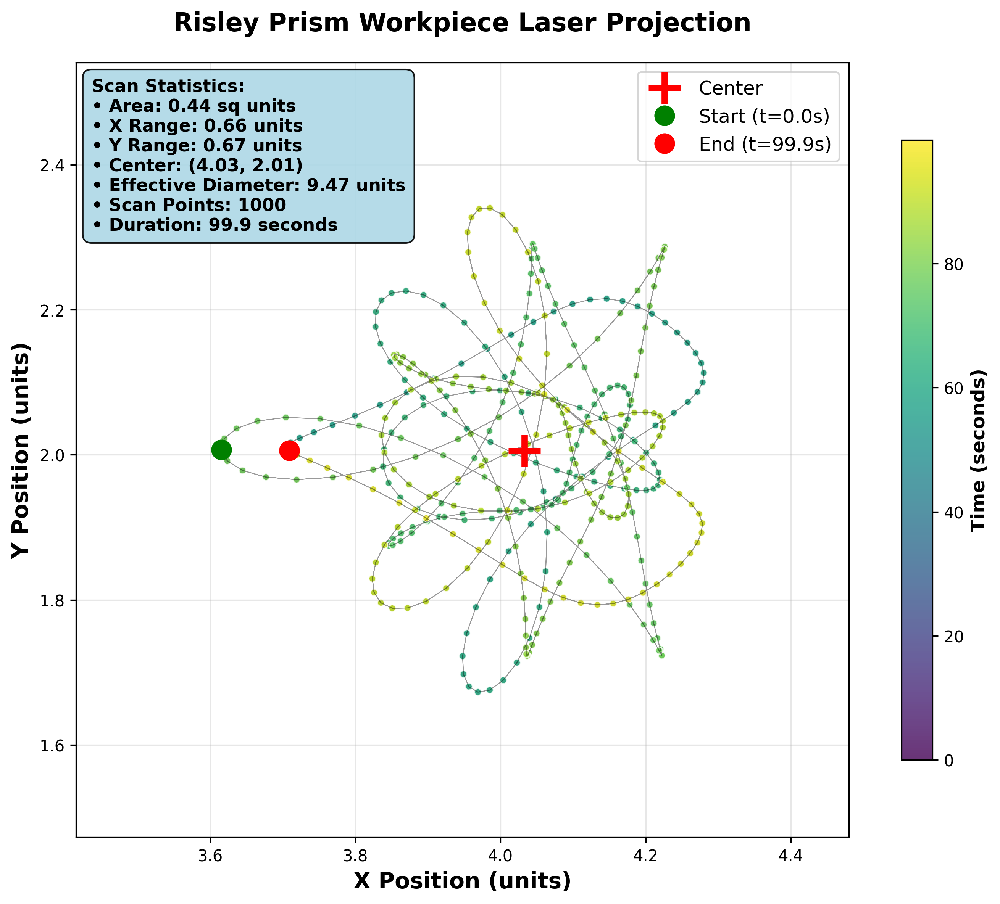
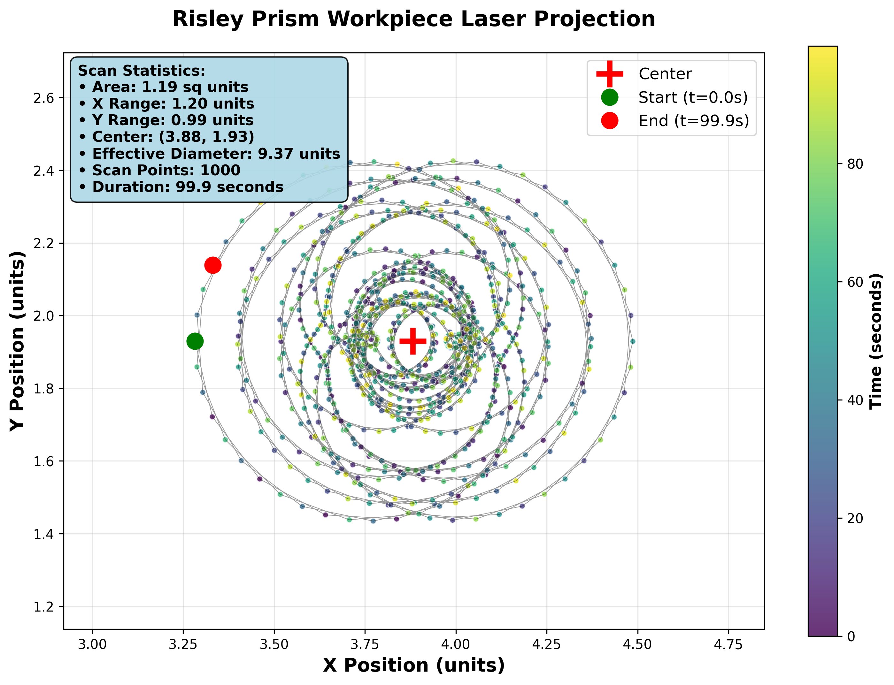
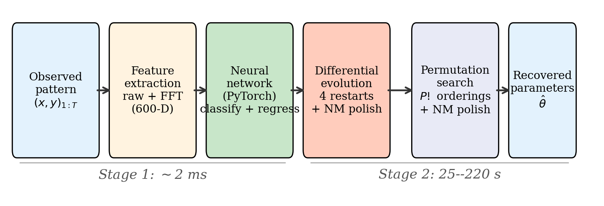
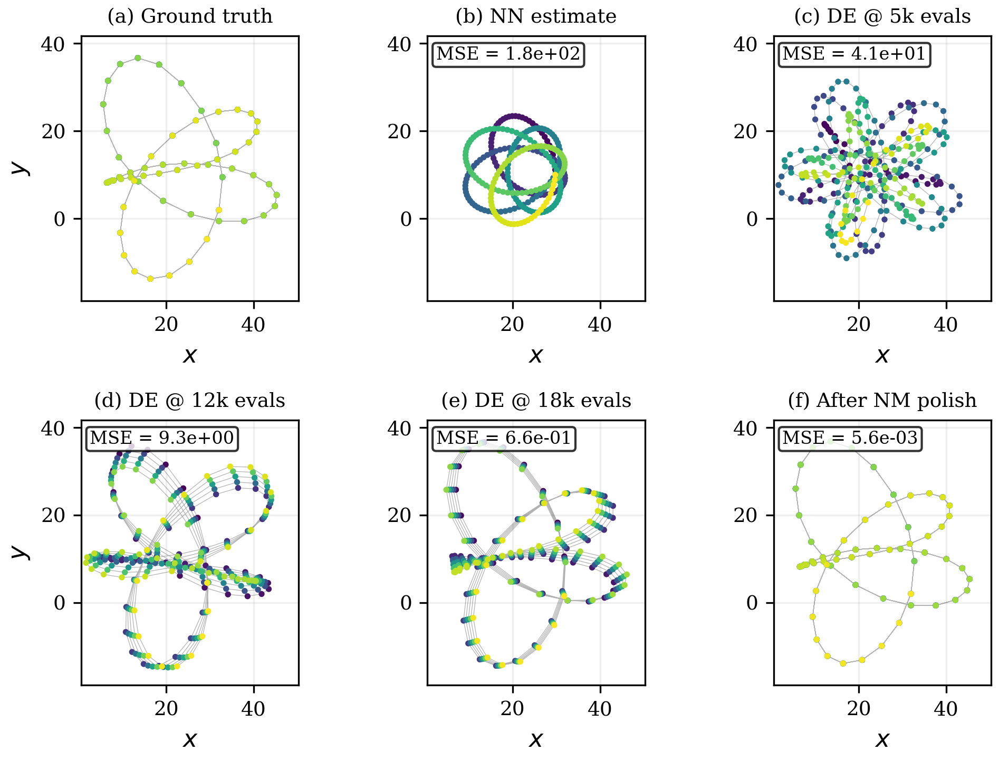
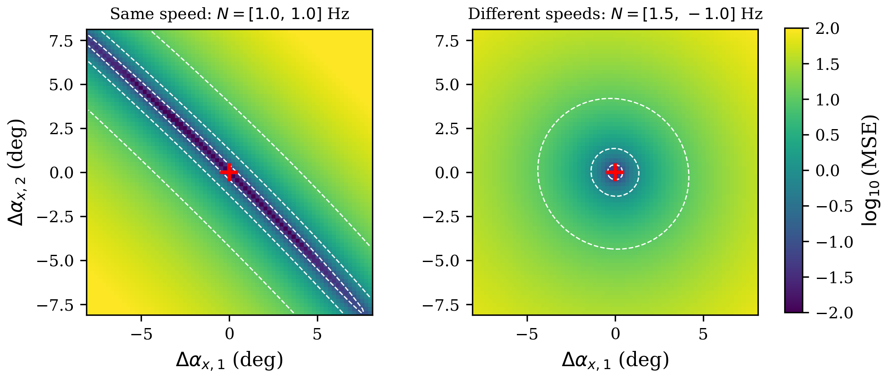

# Solving the Inverse Multi-Prism Risley Problem

**Parameter recovery from beam scan patterns via neural-guided global optimisation**

J. Babcanec (Benedict College) &nbsp;&middot;&nbsp; B. Campbell (Robert Morris University)

---

Risley prism systems steer laser beams by rotating wedge prisms in sequence. Given an observed scan pattern on a workpiece — *the picture* — this solver recovers the complete physical specification of the prism system that produced it: rotation speeds, wedge angles, glass refractive indices, and system geometry.

<p align="center">
  
</p>

## Scan Pattern Gallery

A single prism traces an ellipse. Two prisms produce epicyclic loops. Three or more create dense, multi-lobed patterns:

<p align="center">
  
</p>

Higher wedge counts produce increasingly complex structures:

<p align="center">
  
  
  
</p>
<p align="center"><em>Left to right: 4-wedge rosette, 5-wedge counter-spiral, 5-wedge chaotic pattern</em></p>

## The Inverse Problem

The inverse problem — determining which prism parameters produced a given pattern — is hard because:
- The mapping is **nonlinear** (iterated Snell's law at 2P interfaces)
- The parameter space grows as **3P** (speed + two wedge angles per prism)
- Prisms with identical rotation speeds create a **degeneracy** where individual contributions cannot be resolved

### Two-Stage Solver

<p align="center">
  
</p>

**Stage 1 — Neural network** (~2 ms): A multi-task PyTorch network classifies the prism count (99.1% accuracy) and produces an initial parameter estimate.

**Stage 2 — Global optimisation** (25–220 s): Multi-restart differential evolution seeded by the NN estimate, Nelder-Mead polish, and permutation search across all P! prism orderings.

### Convergence Progression

<p align="center">
  
</p>

## Results

All parameters recovered to machine precision across a 10-case test battery:

| Case | Prisms | Interfaces | Speed error (Hz) | Angle_x error (deg) | Angle_y error (deg) | Time |
|------|--------|-----------|------------------|---------------------|---------------------|------|
| Easy | 2 | 4 | 1.2 x 10^-8 | 2.3 x 10^-6 | 3.9 x 10^-5 | 27 s |
| Close speeds | 2 | 4 | 1.0 x 10^-8 | 4.7 x 10^-6 | 2.3 x 10^-5 | 51 s |
| Large angles | 2 | 4 | 1.8 x 10^-8 | 1.4 x 10^-6 | 2.7 x 10^-5 | 76 s |
| Easy | 3 | 6 | 1.9 x 10^-8 | 2.0 x 10^-6 | 4.1 x 10^-5 | 58 s |
| Close speeds | 3 | 6 | 1.3 x 10^-7 | 1.3 x 10^-5 | 2.3 x 10^-4 | 217 s |
| Large angles | 3 | 6 | 2.7 x 10^-8 | 5.7 x 10^-6 | 3.6 x 10^-5 | 217 s |

The solver can also recover **glass refractive indices** (3P to 4P parameters) and **system geometry** — workpiece distance and inter-prism gap (4P to 4P+2 parameters). The most demanding configuration tested: **14-D full recovery** for 3 prisms, recovering all parameters plus distances to machine precision in ~48 minutes on a single CPU core.

### Identifiability

Prisms must rotate at **distinct speeds** for the inverse to be well-posed. When two prisms share the same speed, a degenerate valley appears in the MSE landscape — the optimizer cannot determine how much deflection each prism contributes:

<p align="center">
  
</p>

## Physical Model

Each wedge prism has **two refractive interfaces** (entry + exit face) rotating in lockstep as a rigid body. Refractive indices alternate air-glass-air along the optical path:

```
n = [1.0, n_g1, 1.0, n_g2, 1.0, n_g3, 1.0]
      air  glass  air  glass  air  glass  air
```

Refraction at each interface follows vector Snell's law:

```
s_f = eta * (N x (-N x s_i)) - N * sqrt(1 - eta^2 * |N x s_i|^2)
```

The forward model is fully vectorised over all T time steps (~0.5 ms per 200-point pattern), validated to 4 x 10^-13 against a serial reference implementation.

## Quick Start

### Forward simulation

```python
from reverse_problem_v2.core import PrismParameters, fast_forward

# 3-prism system
params = PrismParameters(
    n_prisms=3,
    rotation_speeds=[1.5, -1.0, 2.0],   # Hz
    wedge_angles_x=[12.0, -8.0, 5.0],   # degrees
    wedge_angles_y=[3.0, 10.0, -6.0],   # degrees
)

pattern = fast_forward(params, n_points=200, time_limit=10.0)
# pattern.shape = (200, 2)  — workpiece (x, y) positions
```

### Reverse solver

```bash
cd reverse_problem_v2

# Train and evaluate (generates 200k samples, trains NN, runs test battery)
python pipeline.py --wc 2 3 --samples 100000 --epochs 200
```

```python
from reverse_problem_v2.pipeline import Pipeline

p = Pipeline(prism_counts=[2, 3])
p.run()  # train + evaluate

# Solve a single pattern
result = p.solve(pattern, n_prisms=3)
# Returns: recovered speeds, wedge angles, reconstruction MSE
```

### Classic forward model

```python
from model import main
main()  # runs with parameters from inputs.py, saves to output/
```

## Project Structure

```
wedge/
├── model.py                  # Forward simulation (original)
├── inputs.py                 # Global parameters
├── generate_examples.py      # Multi-wedge example generator
├── calcs/                    # Physics calculations
│   ├── init_coords.py        #   Initial beam-wedge intersection
│   ├── calc_proj_coord.py    #   Snell's law refraction + tracing
│   └── calc_z_coord.py       #   Z-coordinate calculation
├── utils/                    # Utilities (trig, saving, analysis)
├── reverse_problem_v2/       # Inverse solver
│   ├── core.py               #   Fast vectorised forward model
│   ├── neural_network.py     #   PyTorch multi-task network
│   ├── genetic_algorithm.py  #   GA refinement (alternative)
│   └── pipeline.py           #   Full training + evaluation + solving
├── paper/                    # Publication
│   ├── main.tex              #   LaTeX source
│   ├── main.pdf              #   Compiled paper
│   └── figures/              #   All paper figures
└── output/examples/          # Forward simulation outputs
```

## Requirements

```
numpy
scipy
torch
matplotlib
```

## Paper

The full paper is in `paper/main.pdf`. To compile from source:

```bash
cd paper
pdflatex main.tex && pdflatex main.tex
```

## References

- S. Risley, "A new form of flexure spectroscope," *Am. J. Sci.* **37**, 451 (1889)
- G. F. Marshall, "Risley prism scan patterns," *Proc. SPIE* **3787**, 74-86 (1999)
- Y. Yang, "Analytic solution of free space optical beam steering using Risley prisms," *J. Lightw. Technol.* **26**(21), 3576-3583 (2008)
- Y. Li, "Third-order theory of the Risley-prism-based beam steering system," *Appl. Opt.* **50**(5), 679-686 (2011)
