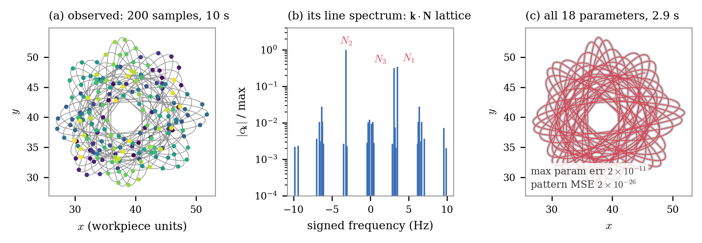
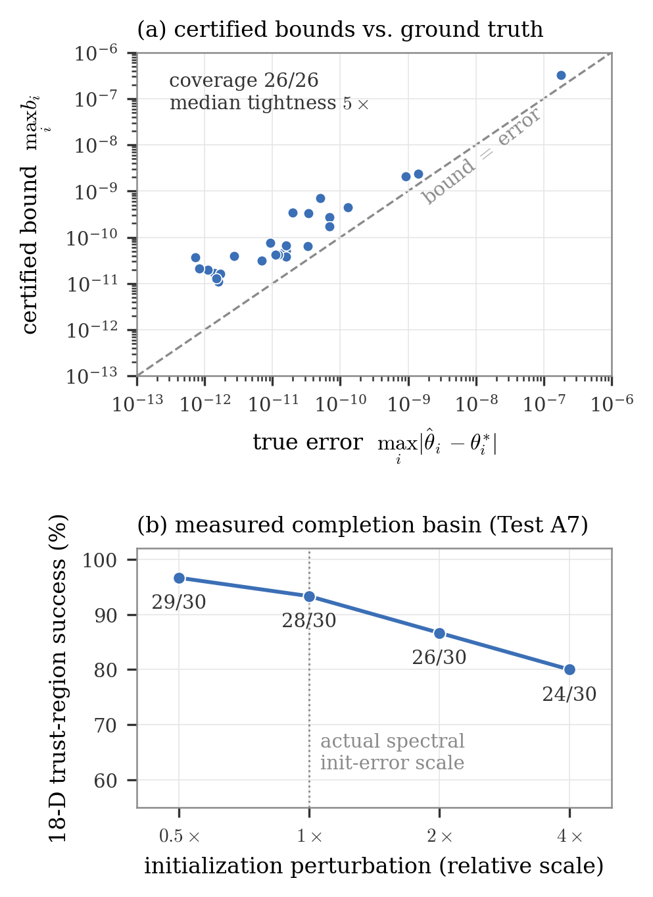

# Frequency-Lattice Inversion of Multi-Prism Risley Systems

**Blind recovery of a beam-steering system's *complete* physical specification from a single observed scan pattern — with a certificate on every answer.**

J. Babcanec (Benedict College) &nbsp;&middot;&nbsp; B. Campbell (Robert Morris University)

*Simulation study, torch-free reference implementation. Paper targeting* Inverse Problems *(IOP) — draft in [`paper/main.pdf`](paper/main.pdf).*

---

A Risley system steers a laser by spinning a stack of wedge prisms. Point a detector at the workpiece and you record one thing: a cloud of `(x, y)` positions over time — *the picture*. This project recovers the machine that drew it.

Not the pointing angles (that is the classical, well-studied problem). The **hardware**: every rotation speed *with its sign*, both wedge-angle components of every prism, every glass index, the layout distances, and the beam source. For `P` prisms that is **`4P + 6` parameters** — 18 for the reference `P = 3` case — recovered **blind**, from **one** passively observed pattern, to **near machine precision**. No prior nominal, no controlled measurements, nothing assumed known.

<p align="center">
  
</p>
<p align="center"><em>
(a) One observed pattern — 200 samples over 10 s.  (b) Its analytic signal <code>z = x + iy</code> is a line spectrum living on the integer lattice generated by the <strong>signed</strong> speeds; the three fundamentals <code>N₁, N₂, N₃</code> read straight off it.  (c) All 18 parameters recovered in 2.9 s: max parameter error 2×10⁻¹¹, pattern MSE 2×10⁻²⁶.
</em></p>

> **Why this is new.** The Risley "inverse problem" in the literature almost always means *beam steering* — known hardware, solve for the prism angles that hit a target. The rare work that estimates hardware does so only as small corrections around a *known design*, for two prisms, never blind. Recovering the full specification — speeds (the rotation *dynamics*, absent from every calibration setting), wedge magnitudes, indices, geometry, and source together — blind, from a single pattern, for `P ≥ 2`, has **no prior reported solution**.

---

## The idea in one paragraph

Write the scan as a complex signal `z(t) = x(t) + i·y(t)`. It is **quasi-periodic on a rank-`P` integer lattice** whose generators are the signed rotation speeds: every spectral line sits at an integer combination `k·N` of the speeds `N = (N₁,…,N_P)`. That single structural fact turns identification into lattice fitting:

- **the generators of the lattice *are* the speeds** — sign and all (a real-valued FFT cannot see rotation direction; the analytic signal can);
- **the phases of the fundamental lines are the wedge orientations, exactly**;
- **their amplitudes fix the wedge magnitudes.**

So there is nothing to search. No enumeration of sign combinations, no frequency-triple guessing, no angle grid, no training — the failure modes that plagued every FFT-peak-picking predecessor simply do not arise. This is the [Laskar frequency-map / NAFF](#references) viewpoint (recover a torus from its dominant lines), applied to Risley system identification for the first time.

## How the solver works

A single constructive pass, `risley_lattice/`:

| Stage | Module | What it does |
|-------|--------|--------------|
| **1. Spectrum** | `spectral.py` | Matrix-pencil line estimation on `z = x+iy` → complex lines; `extract_speeds` returns the **signed** speeds. `P`-agnostic. |
| **2. Lattice** | `lattice.py` | CLEAN-style greedy line growth + integer-coverage basis identification → the rank-`P` generating lattice and its fundamentals, by variable projection. |
| **3. Angles** | `angles.py` | Fundamental-line **phases → wedge orientations**; **amplitudes → wedge magnitudes** (cubic inversion). |
| **4. Completion** | `solve.py` | One trust-region (TRF) step on the **exact** forward model → all `4P+6` parameters to near machine precision. `solve9` (geometry known) / `solve18` (nothing known). |
| **5. Certificate** | `certify.py` | **Success:** per-parameter error bounds from the exact-model Jacobian. **Failure:** a Fisher-information impossibility statement naming the deficit — pair resolvability, prism detectability, lattice degeneracy, mask budget, front-end capacity — and the observation time `T` that cures it. |

Every answer is certified. On success you get tight per-parameter bounds; on failure you get a *reason* and a *fix*, never a silent wrong answer.

<p align="center">
  
</p>
<p align="center"><em>
(a) Certified bounds sit above the true error on all 26 solved cases (median 5× loose — tight, never violated).  (b) The trust-region completion basin: at the actual spectral init-error scale it succeeds 28/30, degrading gracefully as the init is perturbed.
</em></p>

## The physical model

Each prism is a solid glass wedge: a flat entry face and a tilted exit face, both rotating in lockstep as one rigid body. The index alternates air → glass → air along the path, and refraction at each of the `2P` interfaces follows the vector Snell law. `P` prisms ⇒ `2P` interfaces.

<p align="center">
  
</p>

The forward map — speeds set the rotation, the wedge angles set the deflection, the geometry sets where the ray lands — produces patterns whose complexity climbs sharply with prism count:

<p align="center">
  
</p>
<p align="center"><em>One wedge traces an ellipse; two produce epicyclic loops; three give dense multi-lobed rosettes. Colour = time.</em></p>

### The 18-parameter vector (`P = 3`)

```
[ N1 N2 N3 | ax1 ax2 ax3 | ay1 ay2 ay3 | ng1 ng2 ng3 | d_W gap | bm_ax bm_ay bm_px bm_py ]
  speeds     wedge angle x   wedge angle y   glass idx     geom      beam angles  beam position
```

**Identifiability is speed-based.** The inverse is well-posed exactly when the signed speeds are distinct in magnitude (`|Nᵢ| ≠ |Nⱼ|`). When two prisms share a speed, a degenerate valley opens in the landscape — the split of deflection between them is unrecoverable — and the certificate reports it. The Jacobian is full rank but ill-conditioned (`κ ≈ 5×10⁵`): geometry parameters are ~five orders of magnitude less sensitive than speeds.

## Results on the standard battery

The seed-2026 development battery (30 random configurations, `T = 10 s`, 200 samples). These are the reproducible dev-loop numbers the package prints today; the paper's headline statistics come from a pre-registered large-scale campaign (below).

| Protocol | Command | Result |
|----------|---------|--------|
| **Full 18-D**, nothing known | `experiments/solve18_battery.py` | **26/30** exact (~10⁻¹¹), ~2 s median |
| 9-D, geometry known | `experiments/solve9_battery.py` | 25/30 exact, <1 s/case |
| Signed-speed extraction | `experiments/speeds_battery.py` | **26/30** signed vs **13/30** for a real FFT baseline |
| Certified bounds | `experiments/certification.py` | 26/26 coverage, 5× median tightness |
| Additive noise | `experiments/noise.py` | recovered at 40 dB **and** 30 dB SNR |
| Prism count `P = 2 / 4` | `experiments/prism_count.py` | `P=2`: 19/20; `P=4`: 17/20 at `T = 40 s` |
| Assumptions A1–A8 | `experiments/assumptions.py` | all green |

Every one of the handful of failures is **certified**, not silent — each falls in a truth-verified class (close speed pair / weak prism / lattice relation / total internal reflection) with a verified `T` that cures it.

### Scaling theory

The paper proves, for general `P`: per-instance cost is **polynomial in `P`**; pairwise speed crowding forces observation time **`Θ(P²)`**; accidental lattice relations force time polynomial of degree equal to the relation order — together a computable **feasibility frontier** in `(P, T)`.

## Quick start

The method is **torch-free** — just NumPy + SciPy. Run from the repo root.

```python
import sys; sys.path.insert(0, ".")           # repo root on path
import numpy as np
from risley_lattice import vec2pat, battery_cases, solve18

theta   = battery_cases()[0]                   # one canonical 18-vector ground truth
pattern = vec2pat(theta)                        # forward map -> (200, 2) workpiece positions

x18, mse, how, info = solve18(pattern)          # blind inverse: nothing assumed known
print("max parameter error:", np.max(np.abs(x18 - theta)))   # ~1e-11 on solvable cases
```

Add a certificate to the recovered answer:

```python
from risley_lattice import certify_success
rmask  = np.repeat(info.get("mask", np.ones(len(pattern), bool)), 2)
bounds = certify_success(x18, pattern, rmask)   # per-parameter error bounds
```

Reproduce any battery (each pins BLAS threads to 1 in its header — multithreaded eig/svd are not bitwise reproducible):

```bash
python experiments/solve18_battery.py     # full 18-D, nothing known
python experiments/speeds_battery.py      # signed speeds vs FFT
python experiments/certification.py       # bounds + failure certificates
python experiments/assumptions.py         # A1–A8 audit
python experiments/noise.py               # pipeline under noise
python experiments/prism_count.py         # P = 2 / P = 4 generality
```

Large-scale cluster sweep (resume-safe JSONL, order-free sharding):

```bash
python experiments/sweep.py --exp adaptive --start 0 --count 100 --tag atlas
# SLURM job array template: experiments/slurm_sweep.sh
```

## Repository layout

```
risley_lattice/            THE method — torch-free frequency-lattice inversion
  model.py                   18-vector box, vec2pat bridge, seed-2026 battery
  spectral.py                matrix pencil, signed-speed extraction (extract_speeds)
  lattice.py                 CLEAN line growth, integer-coverage basis, VarPro
  angles.py                  phase/amplitude -> wedge angles
  solve.py                   solve9 / solve18 + trust-region completion
  certify.py                 success bounds + Fisher failure certificates

experiments/               every reproducible battery + the cluster sweep harness
paper/                     main.tex, main.pdf, figures/, and the baseline solvers
                           the paper compares against (archive/ = superseded one-offs)
reverse_problem_v2/core.py the canonical exact forward model (imported everywhere)

forward_problem/           LEGACY — non-alternating index scheme, gallery generator only
_old/                      older still — ignore
```

`DIARY.md` is the authoritative research log — what was tried, what worked, what failed, and why.

## Status

The paper is a **pre-registered campaign skeleton**: the method, theory, and proofs are complete; the headline statistics are placeholders pending a large-scale Monte Carlo campaign (order 10⁶ random configurations under an adaptive observation protocol, plus order 10⁷ ground-truth certificate checks). The reference implementation and every battery above are final and reproducible today.

## Requirements

```
numpy    scipy          # the method (risley_lattice + experiments)
torch                   # only for the legacy ML baselines the paper compares against
matplotlib              # figure regeneration
```

## Paper

Full draft: [`paper/main.pdf`](paper/main.pdf). Compile from source:

```bash
cd paper && pdflatex main.tex && pdflatex main.tex
```

## References

- S. D. Risley, "A new rotary prism," *Trans. Am. Ophthalmol. Soc.* **5**, 412–413 (1889).
- G. F. Marshall, "Risley prism scan patterns," *Proc. SPIE* **3787**, 74–86 (1999).
- Y. Yang, "Analytic solution of free-space optical beam steering using Risley prisms," *J. Lightw. Technol.* **26**(21), 3576–3583 (2008).
- Y. Li, "Third-order theory of the Risley-prism-based beam steering system," *Appl. Opt.* **50**(5), 679–686 (2011).
- J. Li, K. Chen, Q. Peng, Z. Wang, Y. Jiang, C. Fu, G. Ren, "Improvement of pointing accuracy for Risley prisms by parameter identification," *Appl. Opt.* **56**(26), 7358–7366 (2017) — closest prior art: six error parameters as bounded corrections around a *known* two-prism nominal, from controlled pointing measurements.
- J. Laskar, "The chaotic motion of the solar system: a numerical estimate of the size of the chaotic zones," *Icarus* **88**, 266–291 (1990); J. Laskar, "Frequency analysis for multi-dimensional systems. Global dynamics and diffusion," *Physica D* **67**, 257–281 (1993) — frequency-map analysis (NAFF), the precedent for recovering lattice generators from a quasi-periodic signal.
